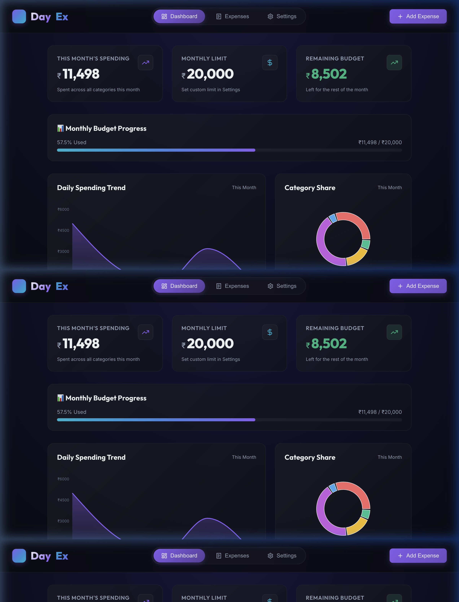
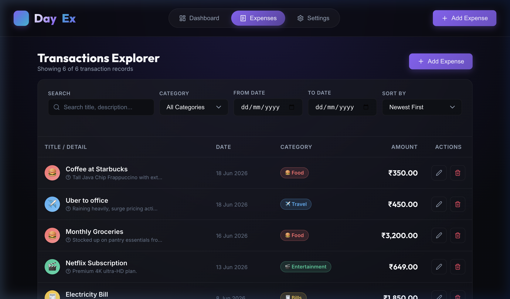

# DayEx 💸

> **A sleek, dark-themed personal expense tracker built with React + TypeScript, powered by a local PostgreSQL 18 database and a Node.js/Express REST API.**

[](https://github.com/jeswintesting-spec/DayEx)


---

## What is DayEx?

DayEx is a full-stack expense management web app designed for tracking daily spending in Indian Rupees (₹). It features a glassmorphism dark UI, real-time category charts, budget alerts, and complete CRUD backed by a real PostgreSQL database — not `localStorage`.

<div align="center">
  
  &nbsp;
  
</div>

---

## Tech Stack

### Frontend
| Technology | Version | Why |
|---|---|---|
| **React** | 18 | Component model, hooks, fast re-renders |
| **TypeScript** | 5 | Type safety across the entire data layer |
| **Vite** | 8 | Instant HMR, near-zero config bundler |
| **Recharts** | latest | Declarative SVG charts, tree-shakeable |
| **Lucide React** | latest | Consistent, lightweight icon set |
| **Vanilla CSS** | — | Full control over glassmorphism effects, no Tailwind overhead |

### Backend
| Technology | Version | Why |
|---|---|---|
| **Node.js + Express** | 4.x | Minimal, fast REST API layer |
| **pg (node-postgres)** | 8.x | Official PostgreSQL client, connection pooling built-in |
| **dotenv** | 16.x | Keeps DB credentials out of source code |
| **cors** | 2.x | Allow Vite dev server (5173) to call API (3001) |
| **PostgreSQL** | 18 | Durable, structured storage; full SQL query power |

---

## Stack Tradeoffs

### Why PostgreSQL over localStorage?
`localStorage` is synchronous, limited to ~5MB, lost on browser data clear, and non-queryable. PostgreSQL gives real persistence, relational integrity, and server-side filtering — essential for a production-grade tracker.

### Why Express over Next.js / Fastify?
Express is the lowest-friction option for a simple JSON REST API. No SSR, no routing complexity. Fastify is faster but overkill here; Next.js would blur the frontend/backend boundary unnecessarily.

### Why Vanilla CSS over Tailwind?
Glassmorphism (backdrop-filter, layered gradients, custom scrollbars) requires granular CSS control. Tailwind's utility classes add friction for complex visual effects and would require a separate config layer for custom design tokens.

### Why client-side filtering in addition to DB filtering?
The current filter/sort is applied on the client after fetching all records. This keeps the API simple and avoids N round-trips for interactive filter changes. For datasets > ~10,000 rows this should be moved to server-side `WHERE` clauses — see [Known Rough Edges](#known-rough-edges).

---

## Project Structure

```
rifafy/
├── server/                  # Express REST API (Node.js)
│   ├── index.js             # API routes (expenses + budget CRUD)
│   ├── db.js                # PostgreSQL connection pool
│   ├── migrate.js           # Schema creation + seed script
│   ├── .env                 # DB credentials (not committed)
│   └── package.json
│
├── src/                     # React + TypeScript frontend
│   ├── api.ts               # Typed fetch() wrappers for all endpoints
│   ├── types.ts             # Shared TypeScript types + category definitions
│   ├── App.tsx              # Root component, tab routing, loading/error states
│   ├── index.css            # Full design system (tokens, glassmorphism, animations)
│   ├── hooks/
│   │   └── useExpenses.ts   # Central state: fetch, CRUD, filters, stats
│   └── components/
│       ├── Dashboard.tsx    # Stats cards + Recharts donut & line chart
│       ├── ExpenseForm.tsx  # Add/Edit drawer with full validation
│       ├── ExpenseList.tsx  # Filterable/sortable transaction table
│       └── BudgetConfig.tsx # Monthly budget limit settings
│
├── package.json             # Frontend deps (Vite, React, Recharts, Lucide)
└── vite.config.ts
```

---

## Prerequisites

- **Node.js** ≥ 18 — [nodejs.org](https://nodejs.org)
- **PostgreSQL 18** installed and running on your system:
  - **macOS:** Recommended via [Postgres.app](https://postgresapp.com) or Homebrew (`brew install postgresql@18`)
  - **Windows:** Download the official installer from [postgresql.org](https://www.postgresql.org/download/windows/)
  - **Linux (Ubuntu/Debian):** `sudo apt install postgresql`

---

## Running from Scratch

### 1. Clone the repo

```bash
git clone https://github.com/jeswintesting-spec/DayEx.git
cd DayEx
```

### 2. Install frontend dependencies

```bash
npm install
```

### 3. Install backend dependencies

```bash
cd server
npm install
cd ..
```

### 4. Configure environment variables

Edit `server/.env` — it ships with safe defaults, but update `DB_PASSWORD` if your PostgreSQL user has a password:

```env
DB_HOST=localhost
DB_PORT=5432
DB_NAME=dayex_db
DB_USER=postgres
DB_PASSWORD=postgres   # ← change this if needed

PORT=3001
```

### 5. Create the database

Depending on your operating system, open a terminal (or command prompt) and run the command to create the database:

**macOS (if using Postgres.app):**
```bash
/Applications/Postgres.app/Contents/Versions/18/bin/psql -U postgres -c "CREATE DATABASE dayex_db;"
```

**Windows / macOS (Homebrew) / Linux (with configured paths):**
```bash
psql -U postgres -c "CREATE DATABASE dayex_db;"
```

> **Note for Linux users:** You may need to run this as the postgres user:
> `sudo -u postgres psql -c "CREATE DATABASE dayex_db;"`

### 6. Run migrations & seed data

```bash
cd server
node migrate.js
cd ..
```

Expected output:
```
✅ Connected to PostgreSQL database
🔧 Running migrations...
✅ Table "expenses" ready
✅ Table "budget" ready
✅ Budget seeded with ₹20,000 default limit
✅ Seeded 6 sample expenses

🎉 Migration complete! Database is ready.
```

### 7. Start the app

Open a terminal in the project root and run:

```bash
npm start
```

This will automatically start both the Node.js API server (on port 3001) and the Vite frontend (on port 5173) simultaneously.

Then open **[http://localhost:5173](http://localhost:5173)** in your browser.

---

## API Endpoints

| Method | Endpoint | Description |
|--------|----------|-------------|
| `GET` | `/api/health` | Health check |
| `GET` | `/api/expenses` | Fetch all expenses (supports `?search=`, `?category=`, `?sort=`) |
| `POST` | `/api/expenses` | Create a new expense |
| `PUT` | `/api/expenses/:id` | Update an expense |
| `DELETE` | `/api/expenses/:id` | Delete a single expense |
| `DELETE` | `/api/expenses` | Wipe all expenses (used internally by restore) |
| `POST` | `/api/expenses/bulk` | Bulk insert in a single transaction |
| `GET` | `/api/budget` | Get current monthly limit |
| `PUT` | `/api/budget` | Update monthly limit |

---

## Features

### ✅ Done
- **Dashboard** — monthly total, all-time total, budget usage ring, category donut chart, daily spend line chart, recent transactions list
- **Transactions Explorer** — full table with search, category filter, month picker, from/to date range, sort by date/month/amount
- **Add / Edit / Delete expenses** — drawer form with full field validation
- **Budget configuration** — set monthly limit, amber/red alert when approaching/exceeding
- **PostgreSQL backend** — real persistent storage via Express REST API
- **Input validation** — title length, amount range (₹0.01–₹10 Cr), 2 decimal precision, date range (2000–2099), future-date warning
- **Filter edge cases** — inverted date range warning, context-aware empty states, Clear All Filters CTA
- **Month filter** — dropdown auto-populated from months that have actual expenses
- **Sort by month** — group expenses by month (newest/oldest first)
- **Loading & error states** — spinner while connecting to DB, error screen if API is down with the exact command to fix it
- **Responsive layout** — mobile floating action button, header collapses on small screens
- **Progressive Web App (PWA)** — installable on mobile and desktop via `vite-plugin-pwa`, complete with manifest, offline service worker, and 192x192 / 512x512 icons

### ⏭️ Skipped (and why)
| Feature | Reason skipped |
|---|---|
| **User authentication / login** | Single-user local app; adds significant complexity (JWT, sessions, bcrypt) with no benefit for a personal tracker |
| **Server-side filtering/pagination** | Data volume is small; client-side is simpler and fast enough. DB indexes are in place for a future migration |
| **Multi-currency support** | App is explicitly designed for INR (₹); currency conversion adds API dependency and UX complexity |
| **Recurring expenses** | Would require a scheduler (cron job or pg_cron) and a separate recurring_expenses table — valid next step |
| **Notifications / budget alerts via email/SMS** | Requires external service (SendGrid, Twilio); out of scope for v1 |
| **Dark/light mode toggle** | Dark glassmorphism is the intended aesthetic; a toggle was deprioritised |
| **Backup & Restore UI** | Removed by user request — the API endpoints (`DELETE /api/expenses`, `POST /api/expenses/bulk`) are still present and functional |
| **Production build / Docker** | App is local-first; no deployment target was specified |

---

## Known Rough Edges

1. **`DB_PASSWORD` in `.env` is committed** — The `.env` file ships with a default password for convenience. For any deployment beyond localhost, add `server/.env` to `.gitignore` and use environment secrets.

3. **Client-side filtering on full dataset** — All expenses are fetched on load and filtered in-memory. For > ~5,000 records this will feel slow. Fix: add `?search=`, `?start=`, `?end=`, `?category=` server-side filtering (the API already supports `?search=` and `?category=`).

4. **No DB connection retry** — If PostgreSQL isn't running when the backend starts, it crashes. A retry loop with exponential backoff would make it more resilient.

5. **Amount input on mobile** — `type="number"` can behave inconsistently across Android browsers (Samsung Internet strips decimals). A `type="text"` with a regex mask would be more reliable.

6. **`id` is a UUID from `gen_random_uuid()`** — Requires PostgreSQL 13+. On older versions, use `uuid-ossp` extension: `CREATE EXTENSION IF NOT EXISTS "uuid-ossp";` and replace `gen_random_uuid()` with `uuid_generate_v4()`.

---

## Database Schema

```sql
-- Expenses table
CREATE TABLE expenses (
  id         UUID PRIMARY KEY DEFAULT gen_random_uuid(),
  title      VARCHAR(100) NOT NULL,
  amount     NUMERIC(12, 2) NOT NULL CHECK (amount > 0),
  category   VARCHAR(50) NOT NULL DEFAULT 'Others',
  date       DATE NOT NULL,
  note       TEXT DEFAULT '',
  created_at TIMESTAMPTZ DEFAULT NOW()
);

-- Budget table (single-row config)
CREATE TABLE budget (
  id             SERIAL PRIMARY KEY,
  monthly_limit  NUMERIC(12, 2) NOT NULL DEFAULT 20000,
  updated_at     TIMESTAMPTZ DEFAULT NOW()
);
```

---

## Contributing

1. Fork the repo — [github.com/jeswintesting-spec/DayEx](https://github.com/jeswintesting-spec/DayEx)
2. Create a feature branch: `git checkout -b feat/my-feature`
3. Commit your changes: `git commit -m "feat: add recurring expenses"`
4. Push and open a PR

---

## License

MIT © Jeswin Sunny
